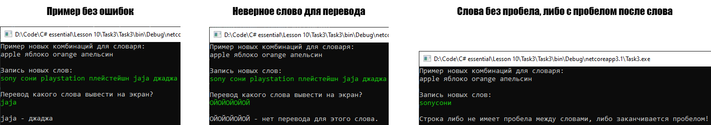

# Lesson10_tast3
Условия задачки:
>Используя Visual Studio, создайте проект по шаблону Console Application.  
Создайте класс MyDictionary<TKey,TValue>. 
Реализуйте в простейшем приближении возможность использования его экземпляра аналогично экземпляру класса Dictionary (Урок 6 пример 5). 
Минимально требуемый интерфейс взаимодействия с экземпляром, должен включать метод добавления пар элементов, 
индексатор для получения значения элемента по указанному индексу и свойство только для чтения для получения общего количества пар элементов.  

Подытог: вот такенный майндфак на выходе
>
